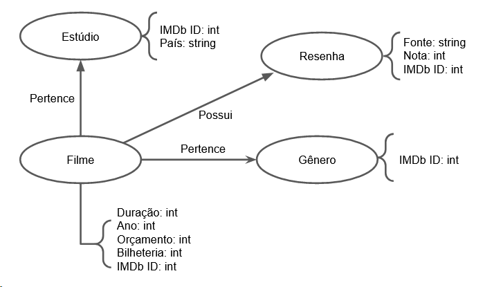

# Apresentação do Lab08 - Modelo Lógico e Análise de Dados em Grafos

# Equipe `Time BDV` - `BDV`
* `Daniel Credico de Coimbra` - `155077`
* `Gabriel Bonfim Silva de Moraes` - `216111`
* `Victor Durço Gomes Bijos` - `206508`

## Modelo Lógico Combinado do Banco de Dados de Grafos
> 

## Perguntas de Pesquisa/Análise Combinadas e Respectivas Análises

### Pergunta/Análise 1
* **Qual o gênero mais isolado?**

  O gênero mais isolado pode ser determinado por uma métrica de centralidade no grafo dos filmes de maior bilheteria em cada um dos últimos 70 anos.

  Closeness centrality é a propriedade de um nó: a somatória do menores caminhos entre cada par de nós. Os gêneros mais comuns (que aparecem em maior quantidade entre os filmes) tendem a ter uma posição mais central, pois se ligariam com uma quantidade maior de filmes e, por consequência, teriam uma closeness centrality alta. Por outro lado, os gêneros incomuns tendem a ter uma closeness centrality menor, sendo assim menos centrais e mais isolados.

  Todavia, não necessariamente o gênero mais comum é o gênero mais central, visto que isso depende da maneira como o grafo se conecta. Por exemplo, um gênero muito comum, mas que costuma ocorrer sozinho (sem coexistência com outros gêneros), provavelmente não seria muito central. Tomemos como exemplo dois gêneros: drama e terror. Podemos analisar a centralidade de ambos os nós. Drama com certeza teria closeness centrality elevada, visto que a maior parte dos filmes possuem elementos dramáticos característicos de se encaixar nesse gênero, de modo que o drama tanto ocorre bastante quanto frequentemente está em conjunto com outros gêneros. Com relação ao terror, são poucos os filmes de alta bilheteria que pertencem a tal gênero, tal como são poucas as combinações de terror com outros gêneros, e dese modo podemos prever que sua closeness centrality seria baixa, portanto, seria um gênero mais isolado.

  Em síntese, para encontrar o gênero mais isolado basta determinar qual é o nó do grafo com menor closeness centrality.

### Pergunta/Análise 2
* **Qual o filme de maior centralidade?**

  A centralidade de filmes será analisada por dois critérios quantitativos de igual peso.

  Primeiro, em termos do conceito de betweenness centrality, que mede o quanto um filme reside na rota mais curta entre quaisquer dois nós no grafo. Um filme com alta centralidade deste tipo seria parte da rota mais curta entre gêneros, estúdios, e filmes distintos. Semanticamente, isso pode se dever a uma série de fatores. Por exemplo, pode se tratar de um filme que mistura gêneros pouco usuais ou que foi co-produzido por estúdios pertencentes a comunidades distantes (cf. pergunta #3), atribuindo assim grande importância sociológica e cultural ao filme.
  
  Segundo, entenderemos a centralidade em termos de vulnerabilidade. Mede-se a vulnerabilidade e um nó avaliando o quanto a eficiência global do grafo diminuiria caso tal nó fosse removido. A eficiência global do grafo consiste no somatório do inverso das distâncias mínimas entre os nós, dividido pelo total de combinações possíveis entre pares de nós.
  
  O filme de maior centralidade será aquele com a maior combinação de betweenness centrality e vulnerabilidade.

### Pergunta/Análise 3

* **Existem comunidades de estúdios?**

  O intuito dessa pergunta é descobrir se existem grupos de estúdios com uma grande quantidade de colaborações entre si, a ponto de formarem uma comunidade dentro da amostra total de estúdios que produziram os filmes de maiores bilheterias dos últimos anos.

  Considerando um grafo onde teríamos os estúdios que se conectam indiretamente entre si, através da produção em conjunto de um filme, poderíamos utilizar a técnica de análise de comunidades para avaliar a existência (ou não) desses grupos. Isso seria feito da seguinte forma: detectar um subgrafo de estúdios que se conectam mais densamente em comparação com o resto da rede ou, alternativamente, em comparação com uma rede randômica.

  Um ponto importante a ser considerado é a precisão da métrica usada para definir o que conta como uma comunidade. Isto é, qual seria seu grau de clique, mais forte ou mais fraco? A determinação desta métrica é mais uma arte do que uma ciência, e para determiná-la acreditamos ser necessário uma visualização inicial da rede, para visualizar padrões de aglomeração entre estúdios.

